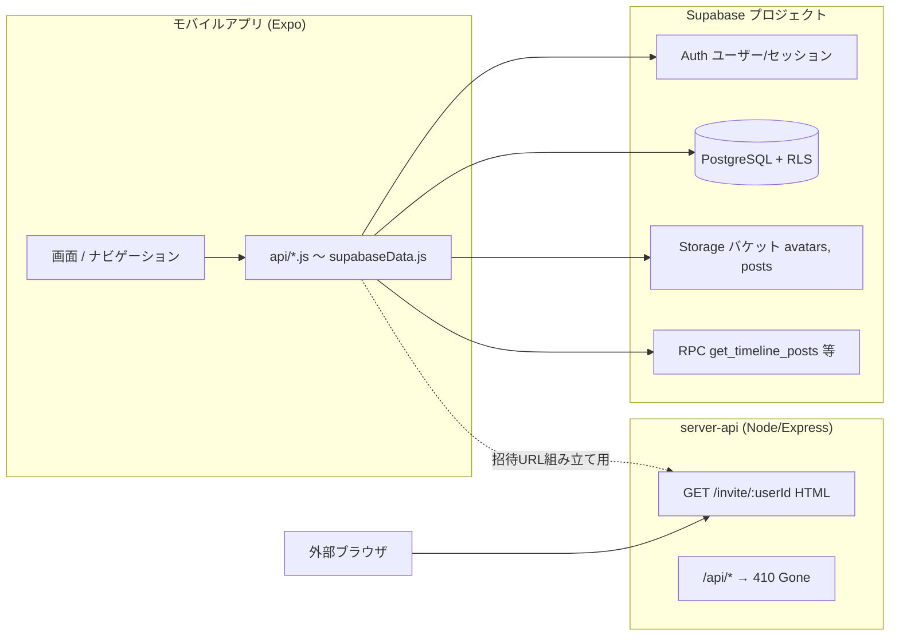
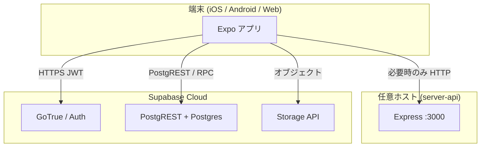
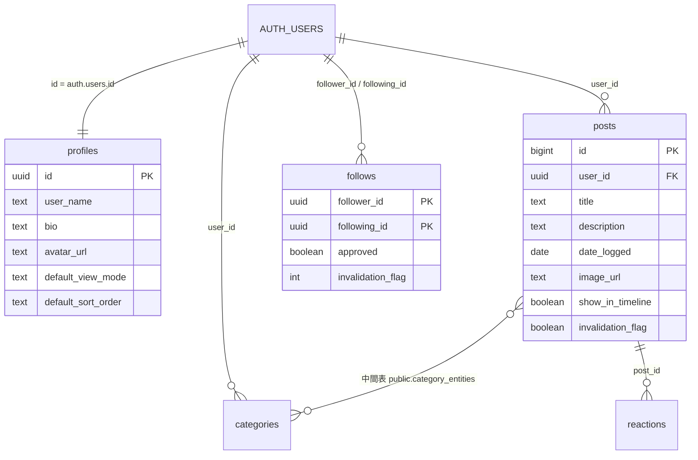

# DaiB アプリケーション仕様書

**対象リビジョン**: リポジトリ内のコード（確認日: 2026-04-25）  
**目的**: 本ドキュメントは、実装に基づくシステム全体の仕様の正本とする。個別の `requirements.md` / `api.md` / `data-model.md` 等と差異がある場合、**本書とコードを優先**する。

---

## 1. プロダクト概要

DaiB（デイビー）は、**日々の記録（投稿）を写真とテキストで残し、整理・閲覧する**モバイルアプリ（React Native + Expo）である。加えて、**相互フォロー（フレンド）**が成立したユーザー同士の**直近7日分の投稿をスレッド（Thread）上で閲覧**し、**絵文字リアクション**を付与できる。

### 1.1 主な利用者向け機能

| 区分 | 内容 |
|------|------|
| アカウント | メール＋パスワード登録/ログイン（Supabase Auth）、パスワード再設定（メールリンク）、セッション永続化（SecureStore 経由） |
| 投稿（旧称: 記録） | 作成/一覧/詳細/更新/論理削除、画像（Storage）、カテゴリー、タイムライン表示フラグ |
| カテゴリー | 作成/一覧/更新/論理削除、投稿との多対多紐付け（**`category_entities`**。クライアント `supabaseData.js` 参照） |
| プロフィール | 表示名・自己紹介・アバター、一覧の表示モード/並び順の既定値 |
| ソーシャル | フォロー申請・承認/否認、フレンド一覧、フォロー中/フォロワー、QR/招待リンク（ユーザーID） |
| スレッド | フレンドの `show_in_timeline` かつ7日以内の投稿、RPC `get_timeline_posts` 取得 |
| 反応 | 定義された絵文字5種のリアクション（投稿あたり自分1種） |
| 設定 | 言語（ja/en）、表示設定、各種静的画面（利用規約・プライバシー等） |

### 1.2 本書のスコープ外・レガシー

- 旧ドキュメントにあった**文言検索ベースのユーザー探索**（公開/非公開の区別等）は、現行クライアントは **QR/招待URL** 中心。  
- **インサイト・統計**（集計・ダッシュボード等）: **本プロダクトの仕様範囲に含めない**（`docs/requirements.md` 等の旧フレーミングは文書上の名残。実装不要）。  
- **server-api 経由の REST（`/api/...`）**は **廃止（410）** 。新規実装は行わない。

---

## 2. システム構成図

### 2.1 論理構成

- **正**: 認証・CRUD・画像は **Expo から Supabase JS クライアント**（anon + ユーザーセッション）で直接アクセス。  
- **補助**: 同一リポ内の `server-api` は **画像ホスティング主体ではない**（画像は Supabase Storage）。**招待用の中間HTML**と **`/api` 廃止応答**に限定。

### 2.2 サーバー/デプロイ配置（概念）

`client-app/config.js` の `SERVER_URL` は、**QR招待リンクの共有文字列**（`https://<ホスト>/invite/<userId>` 形式）用。開発時はローカル LAN 上の `server-api` 等を指す。  
**本番**は Supabase Edge Function `invite-redirect` をホストとして使用し、`EXPO_PUBLIC_SERVER_URL` で **EAS Secrets** から注入する（環境別。本番例: `https://<prod-ref>.supabase.co/functions/v1/invite-redirect`）。詳細は `docs/supabase-environments.md` 参照。

---

## 3. データベース構成（Supabase / PostgreSQL）

### 3.1 ER 図（概念）

- **認証ユーザ**は `auth.users`（Supabase 管理）。アプリ用プロフィールは `public.profiles`（`id` が UUID で `auth.users` と一致）。  
- **投稿**はテーブル名 `posts`（移行: `records` → `posts`、マイグレーション `20260418_*` 参照）。  
- **フレンド判定**は `public.is_friend` 等の定義（**双方の `follows` が有効かつ `approved` が真**; `20260440_follows_approved_flag.sql` 以降）に従う。  
- **カテゴリーと投稿の多対多**は、**`public.category_entities`** を用いる（`client-app/api/supabaseData.js` の `POST_CATEGORY_LINK_TABLE` 等。マイグレーション `20260432_category_entities_rls.sql` 等参照）。

### 3.2 タイムライン

- **RPC** `get_timeline_posts`（`SECURITY DEFINER` / `INVOKER` 等、マイグレーション適用状況で差異）を `supabase.rpc` で呼び出し、**直近7日**・**`show_in_timeline`**・**非論理削除**の投稿を返す。  
- フレンド**のみ**（相互かつ承認済み; マイグレーション定義に準拠）。

### 3.3 旧 MySQL モデルについて

`docs/data-model.md` にある **users / records / user_avatars** 等の **MySQL 向け記述は過去形**とする。現行の正は本節と `supabase/migrations/*.sql` である。

---

## 4. クライアントアプリケーション構成

### 4.1 技術（`client-app/package.json` より抜粋）

| 項目 | 採用 |
|------|------|
| ランタイム | React 19 / React Native 0.81 |
| フレーム | Expo ~54 |
| ナビゲーション | @react-navigation/native, native-stack, bottom-tabs |
| バックエンド | @supabase/supabase-js（主）、旧 REST は不使用 |
| 永続化 | expo-secure-store（Supabase Auth ストレージアダプタ） |
| 画像 | expo-image-picker, expo-image-manipulator, Storage アップロード |

### 4.2 ディレクトリ役割

| パス | 役割 |
|------|------|
| `screens/` | 画面 |
| `navigation/AppNavigator.js` | 未ログイン/ログイン後スタック、タブ相当UI |
| `api/` | `supabaseData` を束ねるファサード（`auth.js` 等、トークン引数は互換用） |
| `context/` | 認証・言語・テーマ・投稿/カテゴリ状態 |
| `utils/supabase.js` | クライアント生成（`EXPO_PUBLIC_SUPABASE_URL` 等必須） |
| `utils/imageHelper.js` | Storage キー/レガシー `uploads/` URL の表示用解決 |
| `locales/` | ja / en |

### 4.3 ナビゲーション上の注意

- 下部タブは**見た目上、フローティングボタン1つで Home/Thread 切替**（`AppNavigator.js` の `CustomTabBar`）。  
- **フレンドハブ**（`FriendHub`）: 友だち/フォロー中/フォロワー一覧と承認操作。  
- 旧 `UserSearch` / 独立 `FollowingList` スタック等は、現行 `AppNavigator` には**未登録**（`FollowListScreen.js` 等は残ファイルの可能性）。  
- **Auth**: `ForgotPassword` / `ResetPassword` が追加。  
- **深いリンク**: `InviteHandler`（`daib` scheme の招待処理）。

### 4.4 環境変数

| 変数 | 用途 |
|------|------|
| `EXPO_PUBLIC_SUPABASE_URL` | プロジェクト URL |
| `EXPO_PUBLIC_SUPABASE_PUBLISHABLE_KEY` | anon（公開）キー |
| `client-app/config.js` | `SERVER_URL`（**招待リンク用**; `EXPO_PUBLIC_SERVER_URL` 必須・EAS Secrets で注入）、`SUPABASE_URL`（画像URL; 原則 `EXPO_PUBLIC_SUPABASE_URL` から導出）、`POST_IMAGES_BUCKET` / `AVATARS_BUCKET` |

| 環境 | `EXPO_PUBLIC_SERVER_URL` |
|------|--------------------------|
| dev | LAN 上 `http://<dev-ip>:3000`（`server-api` ローカル起動）または `https://<dev-ref>.supabase.co/functions/v1/invite-redirect` |
| staging | `https://<staging-ref>.supabase.co/functions/v1/invite-redirect` |
| production | `https://<prod-ref>.supabase.co/functions/v1/invite-redirect` |

---

## 5. server-api（補助サービス）

| 要素 | 内容 |
|------|------|
| 実体 | `server-api/server.js`（Express 5 系想定） |
| `/api/*` | 全メッセージで **410** + `MIGRATED_TO_SUPABASE`（**移行完了後の縮退**） |
| `GET /invite/:userId` | アプリ用カスタムスキーム（`daibapp://invite/...` 等）への導線HTML |
| 静的 | `app.use('/uploads', static)` は**レガシー**互換の名残; 現行の主保存先は Storage |

---

## 6. セキュリティ

- **API キー**: クライアントに埋め込むのは **anon key** のみ。サービスロールはアプリに含めない。  
- **RLS**: `profiles` / `posts` / `categories` / `follows` / `reactions` 等、マイグレーションで有効化。  
- **フォロー**: 申請・承認制（`follows.approved`）。**フレンド**＝所定条件を満たす相互関係。  
- **Storage**: バケット `avatars` / `posts` のパス先頭に `auth.uid()` 相当が来るようポリシー定義。  
- **旧 JWT 自前発行**（`server-api` + `jsonwebtoken`）は **現行フローでは使われない**（廃止）。

---

## 7. 非機能・制約

- オフライン主文は未採用（要件に「将来」あり）。  
- レート制限は **Supabase RPC `rate_limit_check` ベースで Edge Functions に実装済み**（`docs/security-rate-limit-moderation.md`）。アプリ層のクライアント送信頻度上限は今後検討。  
- 画像モデレーションは **Edge Function `moderate-image`（Cloud Vision SafeSearch）で投稿/アバター画像を判定**。`block` 判定時はアップロード直後に巻き戻す。  
- iOS/Android バージョン条件は `docs/requirements.md` の記載を参照するが、**expo ビルドに追随して変動**する。

---

## 8. 運用・デプロイ

本節は **F0–F3 で確定した本番運用方針**を反映する。詳細は `docs/eas-build-guide.md`、`docs/ci-cd.md`、`docs/ops-monitoring.md`、`docs/security-rate-limit-moderation.md`、`docs/supabase-environments.md` を参照。

### 8.1 クライアント（Expo / React Native）

| 項目 | 内容 |
|------|------|
| 日々の起動 | `npm run start`（Dev Client）。Expo Go では AdMob / IAP / Sentry が動かないため、必ず Dev Client ビルドで開発する。 |
| 本番/検証用ビルド | **EAS Build** を採用（`eas.json` あり）。プロファイルは `development` / `preview`（TestFlight）/ `production`（App Store 提出）。 |
| 環境変数 **注入** | クライアント用は `EXPO_PUBLIC_*`。**EAS Secrets** に環境別登録（`EXPO_PUBLIC_SUPABASE_URL`、`EXPO_PUBLIC_SUPABASE_PUBLISHABLE_KEY`、`EXPO_PUBLIC_SERVER_URL`、`SENTRY_DSN`、`ADMOB_*`）。 |
| ストア提出 | iOS のみ。`bundleIdentifier: com.kytm1210.daibapp2026`。`eas submit --profile production` で App Store Connect に自動提出。 |

### 8.2 Supabase（BaaS）

| 項目 | 内容 |
|------|------|
| プロジェクト分離 | **prod / staging / dev** の 3 プロジェクトに分離。各 migration は `supabase db push` または GitHub Actions（`.github/workflows/supabase-migrations.yml`）で同期。 |
| 秘匿 | **anon キー**はクライアントに同梱。**Service Role キー**は Edge Function / CI のみ。`SUPABASE_SERVICE_ROLE_KEY` は GitHub Environment Secrets で管理。 |
| SQL / RLS | 変更は `supabase/migrations/*.sql` の PR レビュー後、main マージで staging 自動反映、tag push（v*）で **手動承認 + prod 反映**。 |
| バックアップ | prod は **Pro プラン**で Daily Backup + PITR を有効化。 |
| Edge Functions | 主要関数: `invite-redirect`（招待）、`delete-account`、`submit-contact`、`revenuecat-webhook`（課金同期）、`moderate-image`。共有秘匿は `supabase secrets` で管理。 |

### 8.3 server-api（招待ページ）

| 項目 | 内容 |
|------|------|
| 役割 | 開発時の招待ページ提供のみ。本番では Edge Function `invite-redirect` に置換。 |
| 配置 | 開発: ローカル LAN（`http://<dev-ip>:3000`）。本番/検証: Supabase Edge Function。 |
| TLS | 本番は Supabase が自動付与。 |
| `/api` | 410 応答のみ（廃止済み）。監視対象外。 |

### 8.4 監視・ログ・インシデント

| 項目 | 内容 |
|------|------|
| クライアント | **Sentry**（`@sentry/react-native`）。環境別 DSN を EAS Secrets に登録。`auth.user.id` を Sentry user として紐付け。 |
| サーバ | Supabase Edge Function ログ → **Better Stack Logs** に Log Drain で転送。重要メトリクスは Slack #ops 通知。 |
| 連絡体制 | SEV1/2/3 を `docs/ops-monitoring.md` §7 に定義。状態ページは Better Stack Status を採用予定。 |

### 8.5 CI / CD

| 項目 | 内容 |
|------|------|
| リポジトリ | `.github/workflows/` に `lint.yml` / `supabase-migrations.yml` / `eas-build.yml` を配置。詳細は `docs/ci-cd.md`。 |
| Lint | ESLint flat config（`client-app/eslint.config.js`）。MVP 期は warn 許容、段階的に厳格化。 |
| ビルド / 提出 | main push → EAS preview ビルド、tag push（`v*`） → production ビルド + App Store Connect 提出。 |
| Migration | main → staging 自動、tag → prod（手動承認）自動。 |

### 8.6 本番 URL 一覧

| 種別 | 値 |
|------|-----|
| クライアント | App Store: `https://apps.apple.com/jp/app/id<APP_ID>`（公開後に確定） |
| 招待中継 | Edge Function `invite-redirect`。`https://<prod-ref>.supabase.co/functions/v1/invite-redirect/<userId>` |
| 深いリンク | `app.json` `scheme: daib`。Universal Links 用ドメインは `<prod-ref>.supabase.co` を使用（招待ページからのフォールバックに利用）。 |
| 状態ページ | Better Stack Status（公開後に確定）。 |
| 法務文書 | `docs/privacy-policy.md` / 利用規約（アプリ内 `TermsScreen`）/ 特商法表記（アプリ内 `SpecifiedCommercialTransactionsScreen`）。 |

---

## 9. 関連ドキュメントと優先度

| 文書 | 内容 | 優先度 |
|------|------|--------|
| 本仕様書 | 全体正本 | 最高 |
| `docs/adr/*` | 個別の意思決定（特に 0004 IAP / 0005 AdMob / 0006 退会） | 高 |
| `docs/supabase-environments.md` | prod/staging/dev 分離、PITR 設定 | 高 |
| `docs/eas-build-guide.md` | EAS Build / Submit 手順 | 高 |
| `docs/ci-cd.md` | GitHub Actions（lint / migrations / EAS） | 高 |
| `docs/ops-monitoring.md` | Sentry / Better Stack / 状態ページ運用 | 高 |
| `docs/security-rate-limit-moderation.md` | レート制限・画像モデレーション | 高 |
| `docs/store-listing.md` | ストア掲載素材・App Privacy 質問票 | 高 |
| `docs/release-checklist.md` | 提出前最終チェックリスト | 高 |
| `docs/testflight-e2e-checklist.md` | TestFlight 検証手順 | 高 |
| 運営者情報（特商法表記） | アプリ内画面 `SpecifiedCommercialTransactionsScreen` を正本とする | 高 |
| `docs/supabase-route-inventory.md` | Express→Supabase 移行マッピング（**計画/棚卸**色が強い） | 中（コードと併読） |
| `docs/api.md` | 旧 **REST** 。現行は **410** 参照 | 低（歴史的） |
| `docs/data-model.md` | 旧 **MySQL** | 低（歴史的） |
| `docs/screen-list.md` | 画面遷移。**更新中** | 中 |

---

## 改訂履歴

| 日付 | 内容 |
|------|------|
| 2026-04-25 | 初版: Supabase 移行後のコードベースに合わせ作成 |
| 2026-04-25 | 追記: `category_entities` 明確化、`SERVER_URL` 本番/検証（仮）、スコープ外＝インサイト/統計、運用・デプロイ（仮含む） |
| 2026-04-26 | F0–F3 完了に合わせて §8（運用・デプロイ）の「（仮）」を確定値に置換、ADR 0004–0006 を追加。`SERVER_URL` を Edge Function `invite-redirect` に確定。 |
